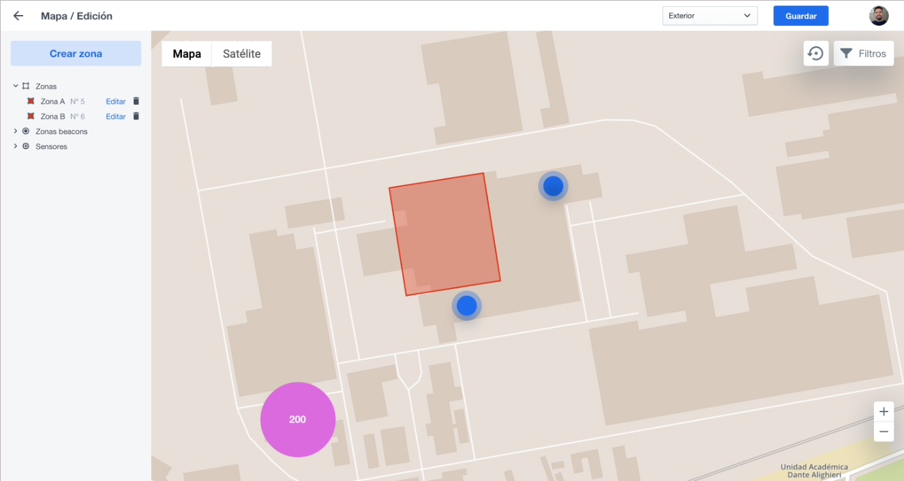
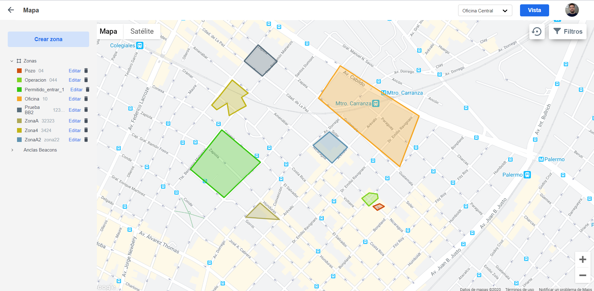
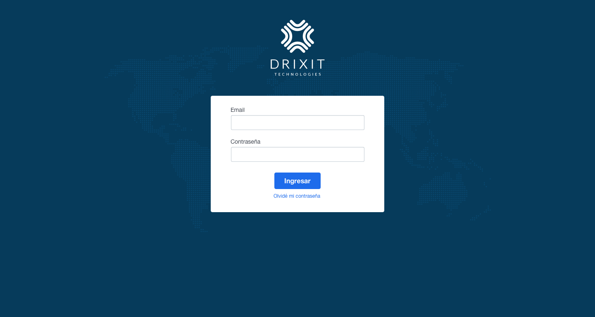

# QA Exercise

### Objetivo
El presente ejercicio tiene una modalidad integradora con 2 partes bien marcadas en la que se busca entender mejor las capacidades del candidato.

### Consigna

A continuación se te presentarán 2 imágenes. Una será el diseño que el equipode UX entregó a los desarrolladores y una segunda imagen en la cual se mostrará el diseño final implementado por el equipo de desarrollo.

**DISEÑO INICIAL (UX TEAM)**

**DISEÑO IMPLEMENTADO (DEV TEAM)**

En base a las imagenes enviadas te pedimos:
- Relevar los issues correspondientes y reportarlos en el board de tu repositorio. Nos interesa ver como los cargas y describis el error a reportar. La idea es simular una situación de trabajo del día a día.

- Detallar brevemente el proceso para la detección de issues y consideraciones a la hora de reportarlos

- Si encontrases un bug en la plataforma que no podés reproducir de manera consistente, cómo lo reportarías? Explicar con ejemplos

### Bonus Points (deseables, no obligatorios)

- Realizar el reporte de los issues del punto anterior en inglés

- Cuales serían los test cases que harías para una pantalla de login?

- Como automatizarías el proceso de testing para esta pantalla? Generar el código asociado comentandolo y explicandolo en detalle con comentarios dentro del mismo.

**Aclaración**: Para este último punto se puede utilizar cualquier tipo de lenguaje o framework

### Metodología de entrega
- Forkea este repositorio en tu cuenta personal y realiza el ejercicio ahí mismo
- Una vez finalizado darle acceso a @gadots @gonpombo8 @mfocaraccio

### Cosideraciones Finales 

Este ejercicio no tiene un tiempo máximo de entrega, lo que si te pedimos es que **dentro de las 48hs de recibido nos indiques para cuando lo vas a tener finalizado**. Te invitamos a que seas vos quien ponga la fecha máxima de entrega.

Cualquier duda que tengas estamos disponibles!

Saludos y suerte!
